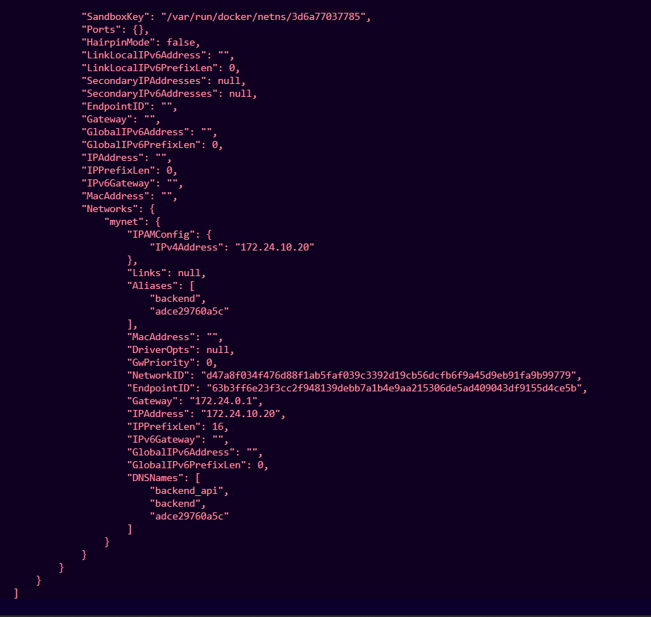
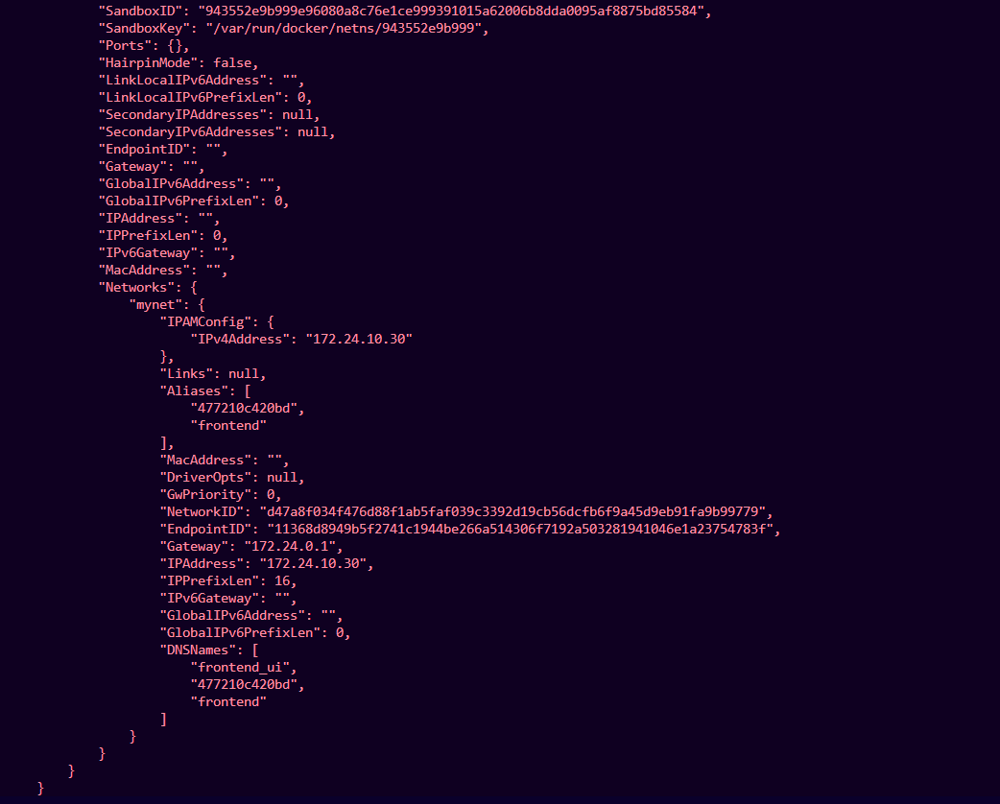
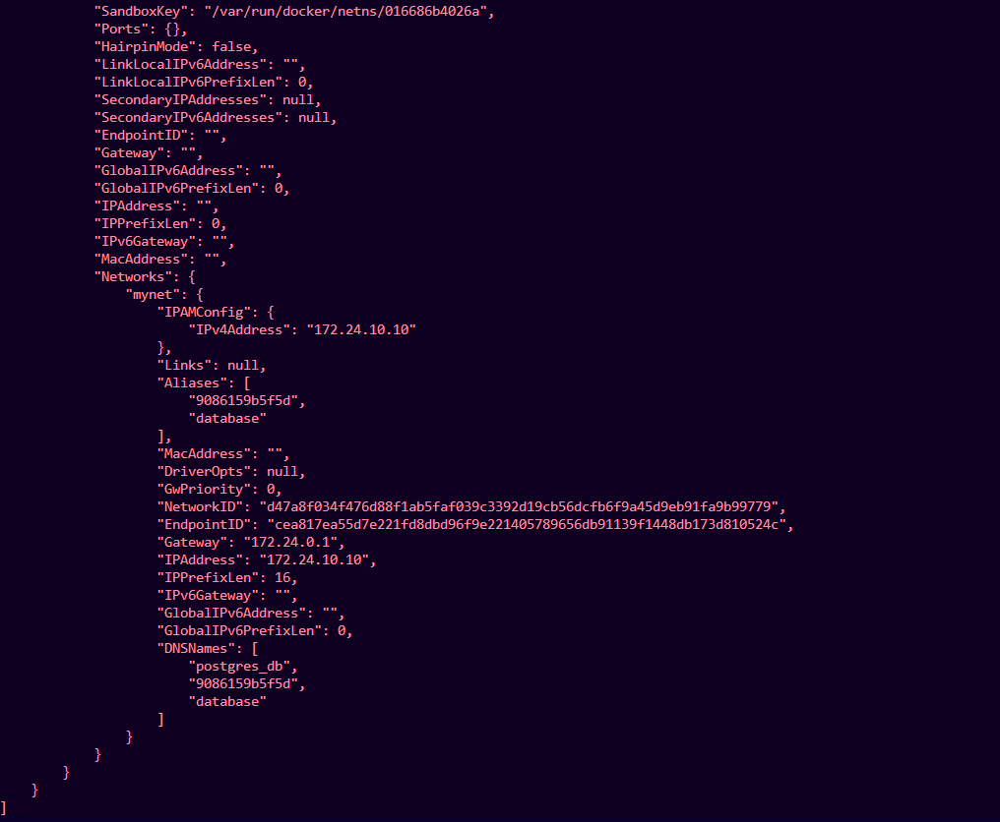

# Project Deliverables

## 1. GitHub Repository

All source code for this project has been pushed to a GitHub repository.

The repository contains:

* Backend source code
* Database setup and configuration
* Frontend UI code
* Dockerfiles for each service
* A Docker Compose file
* Project documentation

🔗 **GitHub Repository:**
[Containerized Web Application Project](https://github.com/rajrishu1401/ContainerizationAndDevOPsLab/tree/main/Assignment/Assignment1)

---

## 2. Individual Dockerfiles

Each service in this project has its own dedicated Dockerfile.

### Backend Dockerfile

**Path:** `backend/Dockerfile`

This Dockerfile builds the Node.js backend API with the following characteristics:

* Uses a multi-stage build process
* Based on the lightweight Alpine Linux image
* Runs as a non-root user for improved security
* Keeps the runtime environment minimal

---

### Database Dockerfile

**Path:** `database/Dockerfile`

This Dockerfile sets up a PostgreSQL container along with the required initialization scripts.

The following environment variables are configured:
```
POSTGRES_DB
POSTGRES_USER
POSTGRES_PASSWORD
```

---

## 3. docker-compose.yml

Docker Compose is used to define and manage all the services together.

The following services are declared:

* `frontend`
* `backend`
* `database`

Key configurations include:

* Static IP addresses for each container
* An external IPVLAN network
* Named volumes for data persistence
* Environment variable injection
* Automatic restart policies
```yaml
version: "3.9"

services:

  database:
    build: ./database
    container_name: postgres_db
    restart: always
    volumes:
      - postgres_data:/var/lib/postgresql/data
    networks:
      mynet:
        ipv4_address: 172.24.10.10

  backend:
    build: ./backend
    container_name: backend_api
    restart: always
    depends_on:
      - database
    environment:
      DB_HOST: 172.24.10.10
      DB_USER: appuser
      DB_PASSWORD: securepassword
      DB_NAME: appdb
    networks:
      mynet:
        ipv4_address: 172.24.10.20

  frontend:
    build: ./frontend
    container_name: frontend_ui
    restart: always
    networks:
      mynet:
        ipv4_address: 172.24.10.30

volumes:
  postgres_data:

networks:
  mynet:
    external: true
```

---

## 4. Custom Network Setup Command

The IPVLAN network used by the containers is created manually before running Docker Compose:
```bash
docker network create -d ipvlan \
--subnet=172.24.0.0/16 \
--gateway=172.24.0.1 \
-o parent=eth0 \
mynet
```

---

## 5. Verification Screenshots

Screenshots have been captured to confirm that the configuration works as expected.

### Network Inspection
```
docker network inspect mynet
```


This output confirms the network configuration and shows which containers are connected along with their assigned IPs.

---

### Per-Container IP Verification
```
docker inspect backend_api
docker inspect frontend_ui
docker inspect postgres_db
```





These outputs confirm that each container has been assigned the expected static IP address.

---

### Volume Persistence Test

Data was inserted into the database before stopping the containers:


The containers were then stopped and restarted:
```
docker compose down
docker compose up -d
```


The data remained intact after restarting, confirming that the named volume is working correctly.

---

## 6. Report

### Build Optimization

The backend service uses a **multi-stage Dockerfile with an Alpine base image** to keep the final image small and secure. The idea behind multi-stage builds is to separate the build process from the actual runtime — so only the files needed to run the application end up in the final image.

#### Backend Dockerfile
```dockerfile
FROM node:20-alpine AS builder

WORKDIR /app
COPY package.json .
RUN npm install --production
COPY server.js .

FROM node:20-alpine

WORKDIR /app
COPY --from=builder /app /app

RUN addgroup -S appgroup && adduser -S appuser -G appgroup
USER appuser

EXPOSE 5000
CMD ["node", "server.js"]
```

#### Summary of Optimization Techniques

* **Alpine base image** — significantly smaller than standard Linux distributions
* **Multi-stage build** — strips out build-time dependencies from the final image
* **Non-root user** — reduces the attack surface of the running container
* **Minimal layers** — keeps the image lean and faster to pull

The result is a container image that is noticeably lighter and more secure than a conventional single-stage build.

---

### Network Architecture

The three containers communicate over a shared custom IPVLAN network. The general flow of traffic is:
```
Client
  │
  ▼
Frontend Container (172.24.10.30)
  │
  ▼
Backend Container (172.24.10.20)
  │
  ▼
PostgreSQL Container (172.24.10.10)
```

---

### Image Size Comparison

Two versions of the backend image were built — one using an Alpine base with a multi-stage build (`optimizedsize_backend`), and another using a standard single-stage setup (`normal_backend`).
```
docker images
```


As visible in the output, the optimized image is considerably smaller than the standard one, demonstrating the practical benefit of using Alpine and multi-stage builds.

---

### Macvlan vs IPVLAN

| Feature | Macvlan | IPVLAN |
|---|---|---|
| MAC Address | Each container gets a unique MAC | All containers share the host MAC |
| Host Communication | Not possible by default | Supported |
| Network Isolation | Higher | Moderate |
| Best suited for | Simulating physical network setups | Virtualized and cloud environments |

IPVLAN was selected for this project because it works reliably within WSL2, where Macvlan has known compatibility limitations.