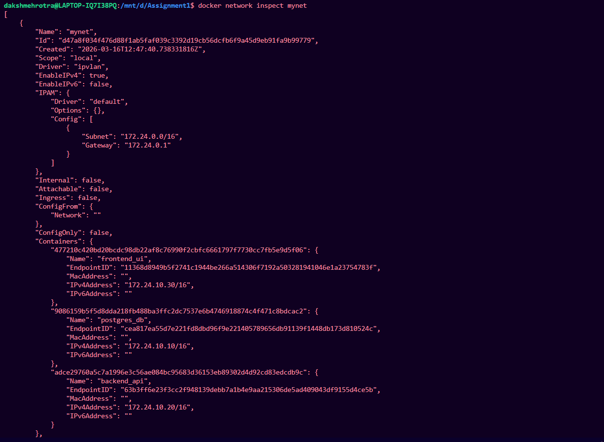
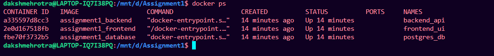
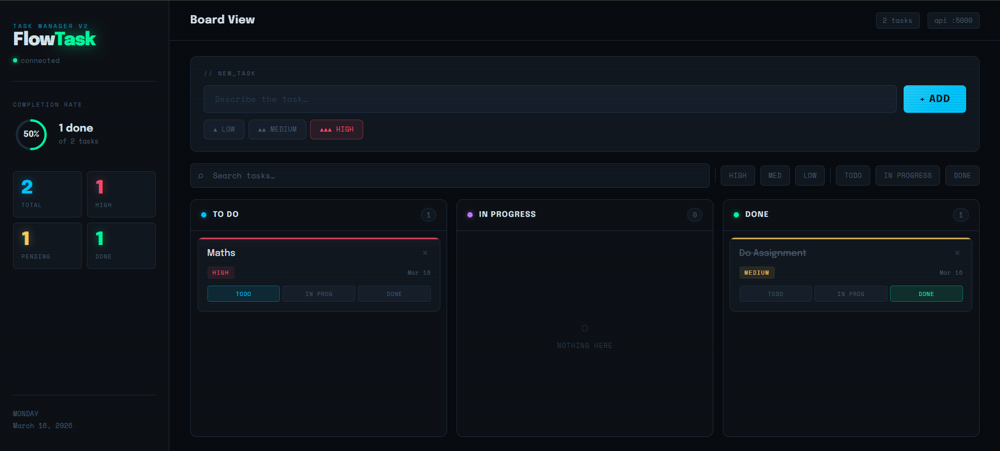
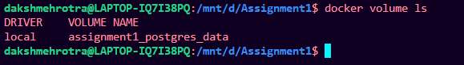
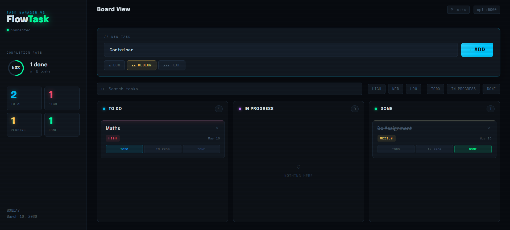
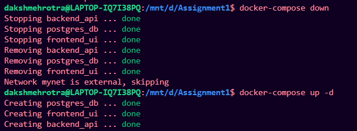
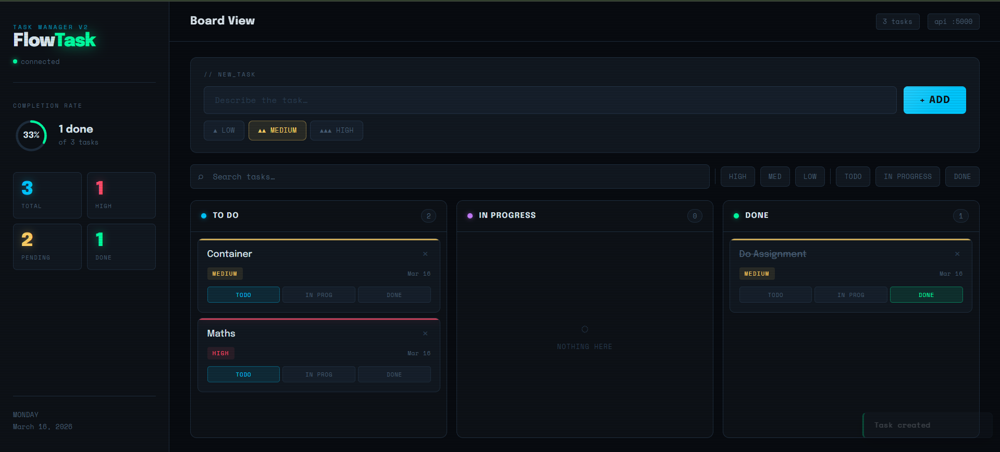
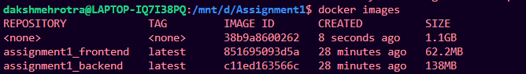

# Containerized Web Application with PostgreSQL using Docker Compose and IPVLAN

## Overview

This project demonstrates a **containerized full-stack web application** using Docker.
It includes a **frontend, backend API, and PostgreSQL database**, orchestrated with **Docker Compose** and connected through an **IPVLAN network with static IP addresses**.

The project demonstrates **Docker image optimization techniques**, comparing:

* Optimized build (Alpine + Multi-stage)
* Non-optimized build (Standard images) -> Just for backend image 

This project fulfills the requirements of the **Containerization and DevOps assignment**.

---

# Architecture

```
Client Browser
      │
      ▼
Frontend Container (Nginx)
172.24.10.30
      │
      ▼
Backend API Container (Node.js + Express)
172.24.10.20
      │
      ▼
PostgreSQL Container
172.24.10.10
```

All services communicate through a custom **IPVLAN network**.

---

# Project Structure

```
containerized-webapp
│
├── backend
│   ├── Dockerfile
│   ├── server.js
│   ├── package.json
│   └── .dockerignore
│
├── database
│   ├── Dockerfile
│   └── init.sql
│
├── frontend
│   ├── Dockerfile
│   └── index.html
│
├── docker-compose.yml
├── docker-compose-unoptimized.yml
├── README.md
└── DELIVERABLES.md
```

---

# Technology Stack

| Component        | Technology        |
| ---------------- | ----------------- |
| Frontend         | HTML + Nginx      |
| Backend          | Node.js + Express |
| Database         | PostgreSQL        |
| Containerization | Docker            |
| Orchestration    | Docker Compose    |
| Networking       | IPVLAN            |

---

# Docker Image Optimization

The project demonstrates Docker optimization techniques:

### Optimized Build

* Alpine base images
* Multi-stage builds
* Non-root user
* Minimal layers

### Non-Optimized Build

* Standard images
* Single stage builds
* Larger image sizes

---

# Create Network (Required)

Create IPVLAN network manually:

```bash
docker network create -d ipvlan \
--subnet=172.24.0.0/16 \
--gateway=172.24.0.1 \
-o parent=eth0 \
mynet
```

Verify:

```bash
docker network inspect mynet
```


---

# Build and Run the Application

### Build Containers

```
docker compose build
```

### Start Containers

```
docker compose up -d
```

### Check Running Containers

```
docker ps
```


---

# Container IP Addresses

| Service    | IP           |
| ---------- | ------------ |
| PostgreSQL | 172.24.10.10 |
| Backend    | 172.24.10.20 |
| Frontend   | 172.24.10.30 |

---

# API Endpoints

### Health Check

```
GET /health
```

Example:

```
http://localhost:5000/health
```

Response

```json
{
"status":"OK"
}
```

---

### Insert User

```
POST /users
```

Example request:

```json
{
"name":"Daksh",
"email":"mehrotradaksh2005@gmai.com"
}
```

---

### Fetch Users

```
GET /users
```

Response

```json
[
 {
  "id":1,
  "name":"Daksh",
  "email":"mehrotradaksh2005@gmail.com"
 }
]
```

---

# Testing API using curl

# Application Usage

The application can be accessed through the frontend interface.

Open the frontend in a browser:

http://172.24.10.30

The interface allows users to:

• Add new user records  
• View stored user records  
• Check backend health status  

---

# Adding Data Through Frontend

Steps:

1. Open the frontend page.
2. Enter **Name** and **Email** in the input fields.
3. Click **Add User**.
4. The request is sent to the backend API.
5. The backend stores the data in the PostgreSQL database.

---

# Fetching Stored Records

Steps:

1. Click the **Refresh** button.
2. The frontend sends a request to the backend.
3. Backend retrieves records from PostgreSQL.
4. Records are displayed on the page.

---

# Health Check

The frontend also provides a **Health Check button**.

When clicked:

Frontend → sends request to backend `/health` endpoint.

Expected response:

{
  "status": "OK"
}

This confirms the backend service is operational.



---

# Volume Persistence Test

Check volume:

```
docker volume ls
```



Enter data to volume through frontend:



Stop containers:

```
docker compose down
```

Restart:

```
docker compose up -d
```


Verify previously inserted data still exists.



---

# Image Size Comparison

Check image sizes:

Create one stack with Alpine and multi-stage dockerfile named as opimizedsize_backend and other with no Alpine and single-stage named as normal_backend.

```
docker images
```



We can see that opimizedsize_backend has less size than normal_backend.

---

# macvlan vs ipvlan Comparison

| Feature            | Macvlan               | Ipvlan                   |
| ------------------ | --------------------- | ------------------------ |
| MAC Address        | Unique per container  | Shared                   |
| Host communication | Not allowed           | Allowed                  |
| Performance        | Good                  | Better                   |
| Use case           | LAN device simulation | Virtualized environments |

IPVLAN was selected due to compatibility with virtualized environments like **WSL2**.

---

# Screenshots

## Network Inspect


## Running Containers


## Frontend UI


---

# Key Concepts Demonstrated

* Docker multi-stage builds
* Container networking with IPVLAN
* Static IP assignment
* Docker Compose orchestration
* Persistent storage using volumes
* Image optimization techniques

---

# Author

- Daksh Mehrotra 
- 500125960
- Batch 2 CCVT
